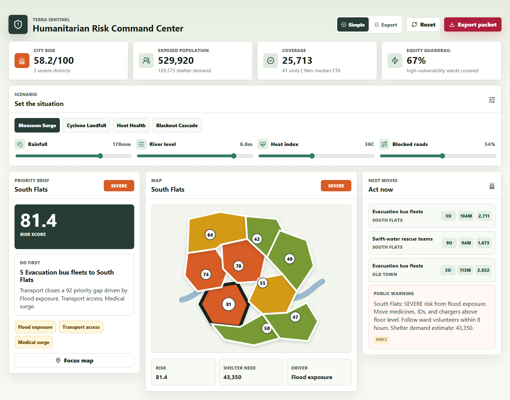
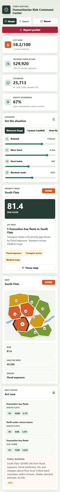

# Terra Sentinel

Humanitarian Risk Command Center for disaster lifelines, resource allocation, and trusted public warnings.

Terra Sentinel is a polished, offline-capable TypeScript app that turns a city-level disaster scenario into:

- a simplified Priority Brief for quick decision-making
- district risk scores and explainable drivers
- FEMA-style lifeline stabilization status
- resource allocation recommendations with ETAs and coverage estimates
- forecast curves for the next 3-12 hours
- multilingual public warning drafts with checksums
- downloadable JSON and CSV briefing packets

The goal is not a dashboard that only looks serious. The interface is driven by deterministic domain logic in `src/domain/engine.ts`, covered by tests, and packaged with architecture, security, and demo documentation.

## Project Snapshot

| Area | Detail |
| --- | --- |
| Experience | Humanitarian risk command center for crisis briefings |
| Core system | District scoring, lifeline status, warnings, resource allocation, JSON/CSV exports |
| Design signal | Priority-first dashboard with verified desktop/mobile screenshots |
| Quality signal | CI, coverage, security audit, GitHub Pages deployment, visual QA |

## Screenshots





## Why It Matters

The project is grounded in real disaster-risk framing:

- UNDRR/WMO track progress toward multi-hazard early warning systems under Sendai Framework Target G.
- FEMA Community Lifelines organize emergency impacts around plain-language critical services.
- WHO's Health EDRM framework emphasizes prevention, preparedness, response, recovery, and multi-sector coordination.
- NOAA's billion-dollar disaster data shows the economic stakes of extreme weather and climate events.

Terra Sentinel combines those ideas into one inspectable prototype for a final-year project, hackathon, civic-tech demo, or emergency-management concept note.

## Run It

```bash
npm install
npm run dev
```

Open the local URL printed by Vite.

## Verify It

```bash
npm run lint
npm run test
npm run build
npm run security:audit
```

The `npm run check` script runs the same quality gates together.

For deployment visual QA, build the site, start the Pages-aware preview server, then run the Playwright smoke check:

```bash
npm run build:pages
npm run preview:pages
npm run qa:visual
```

The visual QA script validates the dashboard heading, district map, priority brief, district count, touch-target sizing, and nonblank desktop/mobile screenshots under the `/terra-sentinel/` GitHub Pages base path.

## What To Demo

1. Select a scenario preset such as `Cyclone Landfall` or `Heat Health`.
2. Use the default `Simple` view for the Priority Brief, map, and next moves.
3. Move the rainfall, river, heat, and traffic controls.
4. Switch to `Expert` for the full lifeline, forecast, incident, and export surface.
5. Export the briefing JSON and CSV files.

## Project Structure

```text
src/
  App.tsx                 command-center UI
  App.css                 responsive operations-console styling
  domain/
    data.ts               districts, incidents, resources, scenarios
    engine.ts             risk scoring, allocation, forecast, warnings
    exporters.ts          JSON/CSV download helpers
    *.test.ts             engine/export tests
  test/setup.ts           jsdom test harness
docs/
  ARCHITECTURE.md
  DEMO_SCRIPT.md
  SECURITY.md
  TEST_PLAN.md
  PITCH.md
```

## Safety Boundary

This is a decision-intelligence prototype with synthetic data. It is not certified for real emergency dispatch, medical triage, evacuation orders, or public warning issuance without expert validation, local data integration, governance review, and field testing.
