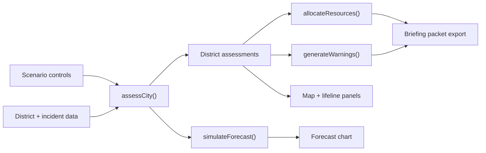

# Architecture

Terra Sentinel is intentionally client-side: no server, no account system, no secrets, and no external runtime data dependency. That makes the demo reliable, private by default, and easy to inspect.

## Layers

### 1. Scenario Inputs

`ScenarioControls` captures stressors:

- rainfall
- river level
- wind
- heat index
- communications outage
- hospital load
- traffic blockage
- forecast horizon

Scenario presets in `src/domain/data.ts` provide fast demo entry points.

### 2. City Data

The synthetic city model includes:

- nine districts with population, vulnerability, density, elevation, drainage, clinics, shelter capacity, and coordinates
- seven community lifeline baselines
- hazard exposure profiles for flood, wind, heat, and landslide
- incident stream from sensors, hospitals, citizens, utilities, and field teams
- finite response resources with staging points, readiness time, and capacity

### 3. Risk Engine

`src/domain/engine.ts` computes:

- projected lifeline degradation
- hazard stress
- district vulnerability
- incident pressure
- composite district risk
- severity labels
- primary explainability drivers
- expected shelter demand

The composite score is deterministic and bounded from 0 to 100. It is designed to be transparent rather than pretending to be a hidden black-box model.

### 4. Allocation Engine

The allocator transforms lifeline deficits into resource needs, then greedily prioritizes recommendations by:

- unmet need
- district risk
- incident pressure
- distance from staging point
- vulnerability equity boost
- finite inventory remaining

Every recommendation includes units, ETA, estimated people covered, and rationale.

### 5. Warning Engine

Warnings are generated for SMS, WhatsApp, public address, and radio. Messages are sanitized to remove control characters and angle brackets, then stamped with a short checksum for traceability in a demo briefing flow.

### 6. UI

The React UI is a dense command center:

- default Simple mode with scenario controls, priority brief, map, and next moves
- Expert mode for analysts who need the full operational surface
- status metric strip
- scenario lab sliders
- interactive SVG risk map
- lifeline stabilization panel
- custom SVG forecast chart
- resource optimization list
- warning composer
- incident stream
- explainability panel

No heavy charting dependency is used; the charts are custom SVG to keep the production bundle lean.

## Data Flow

## Extension Points

- Replace synthetic district data with municipal GIS and census data.
- Add real sensor feeds through a backend ingestion service.
- Introduce calibrated models for flood depth, hospital load, and evacuation travel time.
- Add role-based approvals for public warning publication.
- Integrate audit logging and signed briefing packets.
