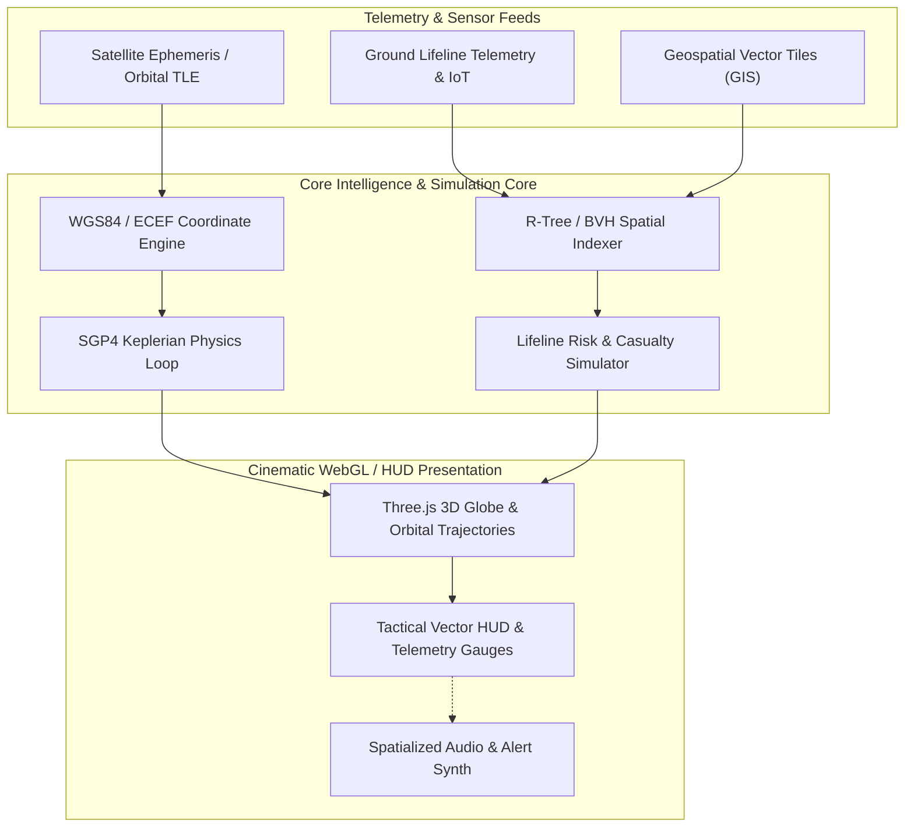
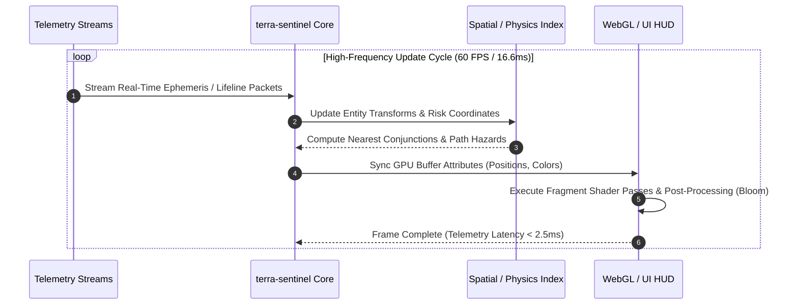
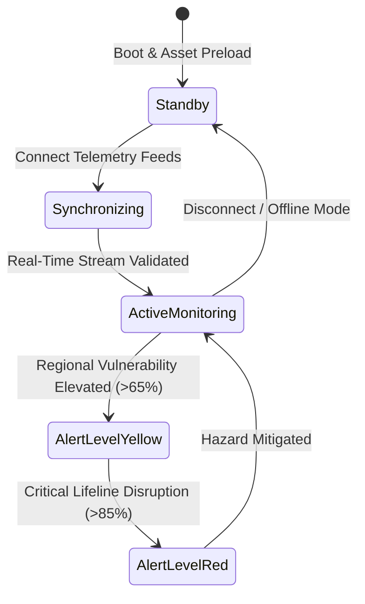

# terra-sentinel: Architecture & System Topology

**Domain**: Humanitarian Risk Command Center for Disaster Lifelines & Aid Allocation  
**System Mission**: Critical humanitarian command center monitoring power grid resilience, potable water supply lifelines, and real-time medical evacuation dispatch in extreme natural disasters.

## 1. System Topology & Geospatial Data Fabric

```mermaid
flowchart TD
    subgraph DataIngestion["Telemetry & Sensor Feeds"]
        SatStream["Satellite Ephemeris / Orbital TLE"]
        GroundSensors["Ground Lifeline Telemetry & IoT"]
        GeoJSON["Geospatial Vector Tiles (GIS)"]
    end

    subgraph CommandCore["Core Intelligence & Simulation Core"]
        CoordEngine["WGS84 / ECEF Coordinate Engine"]
        SpatialIndex["R-Tree / BVH Spatial Indexer"]
        CrisisEvaluator["Lifeline Risk & Casualty Simulator"]
        OrbitalPropagator["SGP4 Keplerian Physics Loop"]
    end

    subgraph Presentation["Cinematic WebGL / HUD Presentation"]
        ThreeCanvas["Three.js 3D Globe & Orbital Trajectories"]
        HUDOverlay["Tactical Vector HUD & Telemetry Gauges"]
        AudioEngine["Spatialized Audio & Alert Synth"]
    end

    SatStream --> CoordEngine
    GroundSensors --> SpatialIndex
    GeoJSON --> SpatialIndex
    CoordEngine --> OrbitalPropagator
    SpatialIndex --> CrisisEvaluator
    OrbitalPropagator --> ThreeCanvas
    CrisisEvaluator --> ThreeCanvas
    ThreeCanvas --> HUDOverlay
    HUDOverlay -.-> AudioEngine
```

## 2. Telemetry Ingestion & Render Sequence

```mermaid
sequenceDiagram
    autonumber
    participant Feeds as Telemetry Streams
    participant Engine as terra-sentinel Core
    participant Index as Spatial / Physics Index
    participant Renderer as WebGL / UI HUD

    loop High-Frequency Update Cycle (60 FPS / 16.6ms)
        Feeds->>Engine: Stream Real-Time Ephemeris / Lifeline Packets
        Engine->>Index: Update Entity Transforms & Risk Coordinates
        Index-->>Engine: Compute Nearest Conjunctions & Path Hazards
        Engine->>Renderer: Sync GPU Buffer Attributes (Positions, Colors)
        Renderer->>Renderer: Execute Fragment Shader Passes & Post-Processing (Bloom)
        Renderer-->>Engine: Frame Complete (Telemetry Latency < 2.5ms)
    end
```

## 3. Command State Lifecycle

```mermaid
stateDiagram-v2
    [*] --> Standby: Boot & Asset Preload
    Standby --> Synchronizing: Connect Telemetry Feeds
    Synchronizing --> ActiveMonitoring: Real-Time Stream Validated
    ActiveMonitoring --> AlertLevelYellow: Regional Vulnerability Elevated (>65%)
    AlertLevelYellow --> AlertLevelRed: Critical Lifeline Disruption (>85%)
    AlertLevelRed --> ActiveMonitoring: Hazard Mitigated
    ActiveMonitoring --> Standby: Disconnect / Offline Mode
```

## 4. Architectural Resilience Guarantees
- **60 FPS Framerate Budget**: Geospatial spatial computations execute off the main thread via Web Workers to prevent rendering micro-stutters.
- **Graceful Asset Fallback**: If photorealistic satellite or terrain texture tiles fail to load, procedural vector contours render seamlessly.
